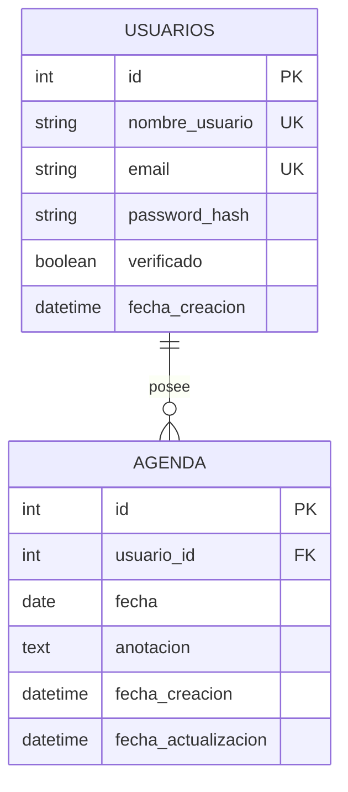

# Sistema de Agenda Personal e Interacción Multiusuario (Flask)

Aplicación web desarrollada en Flask para la gestión de agendas personales y colaboración multiusuario. Ofrece registro seguro con verificación por correo electrónico (OTP), aislamiento de notas por usuario, filtros por fecha y personalización de temas (Claro/Oscuro).

---

## Tabla de Contenidos
- [Características Principales](#características-principales)
- [Tecnologías Utilizadas](#tecnologías-utilizadas)
- [Arquitectura de Base de Datos](#arquitectura-de-base-de-datos)
- [Rutas y Endpoints](#rutas-y-endpoints)
- [Estructura del Proyecto](#estructura-del-proyecto)
- [Configuración y Variables de Entorno](#configuración-y-variables-de-entorno)
- [Guía de Instalación](#guía-de-instalación)
- [Manual de Uso](#manual-de-uso)
- [Capturas de Pantalla](#capturas-de-pantalla)
- [Solución de Problemas](#solución-de-problemas)
- [Autores](#autores)

---

## Características Principales

1. **Autenticación y Seguridad:**
   - Registro con validación de contraseña y verificación mediante código OTP de 6 dígitos enviado por Flask-Mail.
   - Protección contra fuerza bruta con límite de intentos (Rate Limiting).
   - Contraseñas encriptadas mediante Werkzeug.

2. **Gestión de Agenda (CRUD):**
   - Crear, editar, listar y eliminar notas organizadas por fecha.
   - Control para evitar notas duplicadas en un mismo día por usuario.

3. **Filtros y Búsqueda:**
   - Filtro por mes, año y períodos (Hoy, Futuras, Pasadas).
   - Búsqueda por palabras clave y paginación de 10 elementos.

4. **Personalización:**
   - Alternancia entre Modo Claro y Oscuro guardado en cookies.

---

## Tecnologías Utilizadas

- **Lenguaje:** Python 3.11
- **Framework:** Flask 3.1.2
- **Base de Datos / ORM:** SQLite / Flask-SQLAlchemy 3.1.1
- **Seguridad:** Werkzeug 3.1.4
- **Envío de Correos:** Flask-Mail 0.10.0
- **Servidor Producción:** Gunicorn 23.0.0
- **Frontend:** HTML5, CSS3, JavaScript

---

## Arquitectura de Base de Datos

El sistema implementa una relación de 1 a Muchos (1:N) entre usuarios y sus notas de agenda.

- **`usuarios` (`Usuario`):** Almacena credenciales, hash de contraseña y estado de verificación OTP. Relación en cascada con la agenda (`delete-orphan`).
- **`agenda` (`Agenda`):** Registra anotaciones vinculadas al usuario por `usuario_id` y fecha. Posee un índice compuesto `idx_agenda_usuario_fecha`.

---

## Rutas y Endpoints

| Ruta | Métodos | Autenticación | Descripción |
| :--- | :---: | :---: | :--- |
| `/` | GET | No | Redirige según el estado de la sesión (`/agenda` o `/login`). |
| `/registrarse` | GET | No | Formulario de registro. |
| `/registrar` | POST | No | Procesa registro y envía código OTP. |
| `/verify` | GET, POST | No | Valida el código OTP de 6 dígitos. |
| `/reenviar-codigo` | GET | No | Reenvía un nuevo OTP al correo. |
| `/login` | GET, POST | No | Autenticación con Rate Limiting. |
| `/logout` | GET | Sí | Cierra sesión. |
| `/agenda` | GET | Sí | Vista principal con filtros y búsqueda. |
| `/agenda/crear` | GET, POST | Sí | Crea nueva anotación. |
| `/agenda/editar/<id>` | GET, POST | Sí | Modifica anotación existente. |
| `/agenda/eliminar/<id>` | POST | Sí | Elimina anotación. |
| `/cambiar-tema` | POST | No | Cambia preferencia de tema claro/oscuro. |