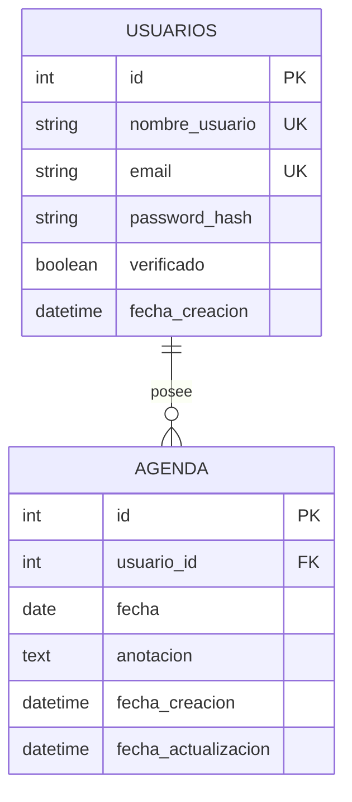

# Sistema de Agenda Personal e Interacción Multiusuario (Flask)


Aplicación web desarrollada en Flask para la gestión de agendas personales y colaboración multiusuario. Ofrece registro seguro con verificación por correo electrónico (OTP), aislamiento de notas por usuario, filtros por fecha y personalización de temas (Claro/Oscuro).

---

## Tabla de Contenidos
- [Características Principales](#características-principales)
- [Tecnologías Utilizadas](#tecnologías-utilizadas)
- [Arquitectura de Base de Datos](#arquitectura-de-base-de-datos)
- [Rutas y Endpoints](#rutas-y-endpoints)
- [Estructura del Proyecto](#estructura-del-proyecto)
- [Configuración y Variables de Entorno](#configuración-y-variables-de-entorno)
- [Guía de Instalación](#guía-de-instalación)
- [Manual de Uso](#manual-de-uso)
- [Capturas de Pantalla](#capturas-de-pantalla)
- [Solución de Problemas](#solución-de-problemas)
- [Autores](#autores)

---

## Características Principales

1. **Autenticación y Seguridad:**
   - Registro con validación de contraseña y verificación mediante código OTP de 6 dígitos enviado por Flask-Mail.
   - Protección contra fuerza bruta con límite de intentos (Rate Limiting).
   - Contraseñas encriptadas mediante Werkzeug.

2. **Gestión de Agenda (CRUD):**
   - Crear, editar, listar y eliminar notas organizadas por fecha.
   - Control para evitar notas duplicadas en un mismo día por usuario.

3. **Filtros y Búsqueda:**
   - Filtro por mes, año y períodos (Hoy, Futuras, Pasadas).
   - Búsqueda por palabras clave y paginación de 10 elementos.

4. **Personalización:**
   - Alternancia entre Modo Claro y Oscuro guardado en cookies.

---

## Tecnologías Utilizadas

- **Lenguaje:** Python 3.11
- **Framework:** Flask 3.1.2
- **Base de Datos / ORM:** SQLite / Flask-SQLAlchemy 3.1.1
- **Seguridad:** Werkzeug 3.1.4
- **Envío de Correos:** Flask-Mail 0.10.0
- **Servidor Producción:** Gunicorn 23.0.0
- **Frontend:** HTML5, CSS3, JavaScript

---

## Arquitectura de Base de Datos

El sistema implementa una relación de 1 a Muchos (1:N) entre usuarios y sus notas de agenda.



- **`usuarios` (`Usuario`):** Almacena credenciales, hash de contraseña y estado de verificación OTP. Relación en cascada con la agenda (`delete-orphan`).
- **`agenda` (`Agenda`):** Registra anotaciones vinculadas al usuario por `usuario_id` y fecha. Posee un índice compuesto `idx_agenda_usuario_fecha`.

---

## Rutas y Endpoints

| Ruta | Métodos | Autenticación | Descripción |
| :--- | :---: | :---: | :--- |
| `/` | GET | No | Redirige según el estado de la sesión (`/agenda` o `/login`). |
| `/registrarse` | GET | No | Formulario de registro. |
| `/registrar` | POST | No | Procesa registro y envía código OTP. |
| `/verify` | GET, POST | No | Valida el código OTP de 6 dígitos. |
| `/reenviar-codigo` | GET | No | Reenvía un nuevo OTP al correo. |
| `/login` | GET, POST | No | Autenticación con Rate Limiting. |
| `/logout` | GET | Sí | Cierra sesión. |
| `/agenda` | GET | Sí | Vista principal con filtros y búsqueda. |
| `/agenda/crear` | GET, POST | Sí | Crea nueva anotación. |
| `/agenda/editar/<id>` | GET, POST | Sí | Modifica anotación existente. |
| `/agenda/eliminar/<id>` | POST | Sí | Elimina anotación. |
| `/cambiar-tema` | POST | No | Cambia preferencia de tema claro/oscuro. |

---

## Estructura del Proyecto

```text
Agenda-Personal/
├── app.py                  # Aplicación principal Flask (Rutas y lógica)
├── models.py               # Modelos SQLAlchemy (Usuario, Agenda)
├── config_mail.py          # Configuración de Flask-Mail
├── requirements.txt        # Dependencias de Python
├── Procfile                # Archivo de despliegue para servidor WSGI
├── .env                    # Variables de entorno locales
├── doc/                    # Documentación y recursos gráficos
│   └── capturas/           # Capturas de la interfaz gráfica
├── instance/               # Base de datos SQLite local (app.db)
├── logs/                   # Archivos de log del sistema (app.log)
└── templates/              # Plantillas Jinja2 HTML
```

---

## Configuración y Variables de Entorno

Crea un archivo `.env` en la raíz del proyecto basándote en el siguiente formato:

```ini
# Clave secreta de Flask
SECRET_KEY=tu_clave_secreta_super_segura

# Configuración de Correo (Gmail SMTP)
MAIL_SERVER=smtp.gmail.com
MAIL_PORT=587
MAIL_USE_TLS=True
MAIL_USERNAME=tucorreo@gmail.com
MAIL_PASSWORD=tu_contraseña_de_aplicacion
MAIL_DEFAULT_SENDER=tucorreo@gmail.com

# Configuración de Cloudinary (Opcional)
CLOUDINARY_CLOUD_NAME=cloudinary_cloud_name
CLOUDINARY_API_KEY=tu_api_key
CLOUDINARY_API_SECRET=tu_api_secret

# Puerto y Depuración (Opcional)
PORT=5000
FLASK_DEBUG=False
```

> Nota: El archivo `.env` no debe subirse al repositorio por razones de seguridad.

---

## Guía de Instalación y Ejecución

### Prerrequisitos
- Python 3.11 o superior.
- Git.
- Cuenta de correo para envío de códigos OTP.

### Pasos

1. **Clonar el repositorio:**
   ```bash
   git clone https://github.com/JHOSEPEMC/Agenda-Personal.git
   cd Agenda-Personal
   ```

2. **Crear y activar el entorno virtual:**
   - En Windows:
     ```bash
     python -m venv venv
     venv\Scripts\activate
     ```
   - En Linux / macOS:
     ```bash
     python3 -m venv venv
     source venv/bin/activate
     ```

3. **Instalar dependencias:**
   ```bash
   pip install -r requirements.txt
   ```

4. **Configurar `.env`:**
   Crea el archivo `.env` según la sección de variables de entorno.

5. **Ejecutar en desarrollo:**
   ```bash
   python app.py
   ```
   Accede a `http://127.0.0.1:5000` en tu navegador.

6. **Ejecutar en producción:**
   ```bash
   gunicorn app:app --bind 0.0.0.0:5000
   ```

---

## Manual de Uso

1. **Registro:** Ingresa a `/registrarse`, completa los datos requeridos y envía el formulario.
2. **Verificación:** Revisa tu correo, copia el código OTP de 6 dígitos e ingrésalo en `/verify`.
3. **Inicio de Sesión:** Inicia sesión con tus credenciales en `/login`.
4. **Uso de Agenda:** Desde el panel principal puedes crear, editar, buscar y eliminar anotaciones organizadas por fecha.
5. **Cambiar Tema:** Alterna la interfaz entre Modo Claro y Modo Oscuro usando el botón de la barra superior.

---

## Capturas de Pantalla

| Vista | Captura |
| :--- | :--- |
| Registro de Usuario | .png) |
| Dashboard de Agenda | .png) |
| Edición de Anotaciones | .png) |
| Verificación OTP | .png) |
| Ajustes e Interfaz | .png) |

---

## Solución de Problemas

1. **Error KeyError: 'SECRET_KEY':**
   - Causa: Falta el archivo `.env` o la variable no está configurada.
   - Solución: Crea el archivo `.env` en la raíz y define `SECRET_KEY=tu_clave`.

2. **Error SMTPAuthenticationError al enviar correo:**
   - Causa: Credenciales SMTP incorrectas o falta Contraseña de Aplicación en Gmail.
   - Solución: Genera una Contraseña de Aplicación de 16 caracteres en la cuenta de Google y colócala en `MAIL_PASSWORD`.

3. **Error con psycopg2 en Windows:**
   - Causa: Falta de binarios compatibles en versiones recientes de Python.
   - Solución: Ejecutar en Python 3.11 que cuenta con `psycopg2-binary` precompilado.

---

## Autores

Proyecto diseñado y desarrollado por:

- **KalebCxDev** - Frontend e Interfaz de Usuario
- **joshuanavarrovelasquez-desig** - Backend y Lógica de Aplicación
- **JHOSEPEMC** - Base de Datos

Copyright 2026 Sistema de Agenda Personal IESTPO. Todos los derechos reservados.